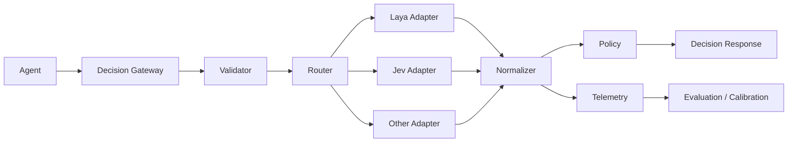

# Architecture

## Components

### Decision Gateway
The public application-facing abstraction. It validates requests, invokes routing, calls an adapter, normalizes the result, and emits telemetry.

### Provider Adapters
Provider-specific integrations:

- Laya: local/self-hosted inference.
- Jev: hosted API.
- Future adapters: classifiers, other System-1 models, or domain-specific decision engines.

### Router
Chooses a provider according to explicit policy.

Example policy:

```yaml
routing:
  primary: laya
  fallback: jev
  min_confidence: 0.85
  on_uncertain: fallback
```

Routing is a Jevlaya feature, not an assertion that Jev or Laya themselves implement this exact policy.

### Registry / Observability
Capture decision metadata for:

- latency
- provider/model
- confidence/probabilities
- outcome
- error rate
- routing path
- cost where available

### Evaluation / Calibration
Offline evaluation should compute:

- accuracy
- soft accuracy
- Brier score
- ECE
- score MAE where applicable
- P50/P95 latency
- throughput
- cost

Calibration should be fitted and validated on held-out data.

## Architecture diagram


